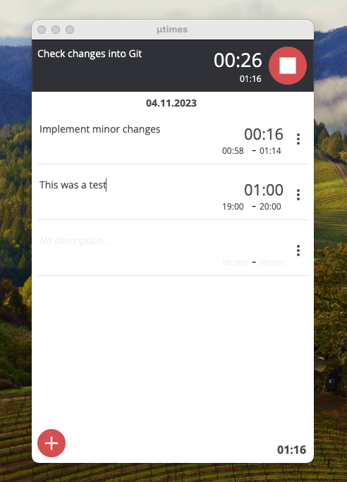

# µtimes

µtimes is a simple plain-text-file based time-tracking application for desktop.

## How it works

When starting, µtimes asks to open a .txt file and reads all time entries.
You can log new work and edit the entries afterwards.

## Features

µtimes is kept deliberately simple and minimalist.

### Plain text file based

No proprietary format. This makes sure that your data will outlive this application. If the app is no longer maintained or used, text files can be handled by literally almost every other application.

### Private 

µtimes works with local files only. It does not depend on any (cloud) service and works offline first. If you want to sync your notes you are free to use any service you want (a file share, Dropbox, OneDrive, ...).

### Minimalist

µtimes contains no bloat. It is simple and has very few features on purpose.